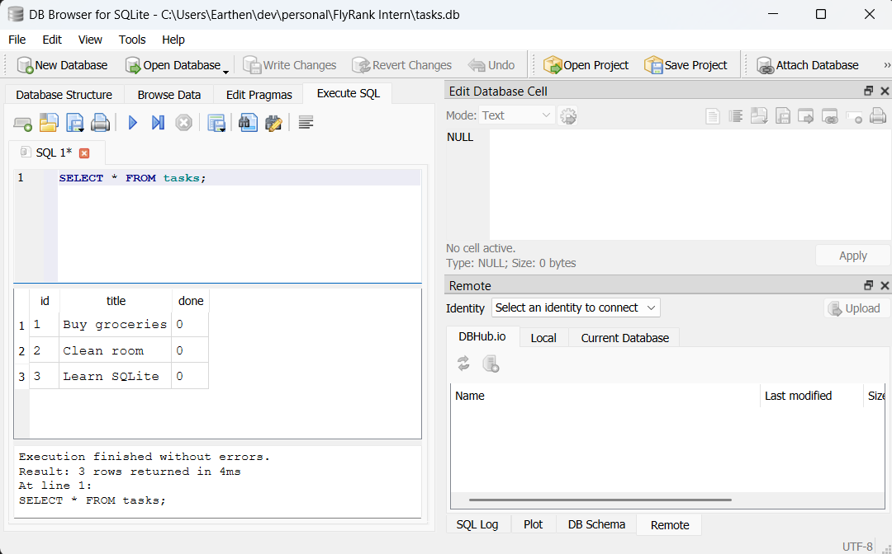

# Task API

A simple CRUD API for managing tasks built with FastAPI and SQLite.

## Why SQLite?

SQLite was chosen as the database for this project because:
- **Single File**: The entire database is stored in a single cross-platform disk file.
- **Zero Setup**: No server installation, configuration, or management is required.
- **Persistent Data**: Unlike an in-memory list, data persists across application restarts.

### Storage Isolation

Because all of the API endpoints (`GET`, `POST`, `PUT`, `DELETE`) remained identical in terms of request/response contracts and behavior when swapping the in-memory array for SQLite, it proves that storage is just an implementation detail. The frontend and client applications interact with the API interface seamlessly without needing to know or care how data is stored.

## Database Details

- **Database File Location**: `tasks.db` (in the project root directory).
- **SQL Table Schema**:
  ```sql
  CREATE TABLE IF NOT EXISTS tasks (
      id INTEGER PRIMARY KEY AUTOINCREMENT,
      title TEXT NOT NULL,
      done BOOLEAN NOT NULL DEFAULT 0
  );
  ```

### SQL Example

You can query the tasks inside the database using the following command:
```sql
SELECT * FROM tasks;
```

Running this query in DB Browser for SQLite against the `tasks.db` file executes a select operation on the `tasks` table, which in this case returned the 3 seeded task rows ("Buy groceries", "Clean room", and "Learn SQLite").

### DB Browser Screenshot

Below is a preview showing the results of executing the query in DB Browser for SQLite, returning the 3 default tasks:




---

## How to Run

1. **Install dependencies** (FastAPI and Uvicorn):
   ```bash
   pip install fastapi uvicorn
   ```
2. **Start the development server**:
   ```bash
   uvicorn main:app --reload
   ```

---

## Endpoints

| Method | Path | Description |
| :--- | :--- | :--- |
| **GET** | `/` | Get API details |
| **GET** | `/health` | Check if server is running |
| **GET** | `/tasks` | List all tasks |
| **GET** | `/tasks/{task_id}` | Get a single task by its ID |
| **POST** | `/tasks` | Create a new task |
| **PUT** | `/tasks/{task_id}` | Update an existing task |
| **DELETE** | `/tasks/{task_id}` | Delete a task |

---

## Example Usage

### Get a single task

**Command (Bash/zsh):**
```bash
curl -i http://localhost:8000/tasks/1
```

**Command (PowerShell):**
```powershell
Invoke-RestMethod -Uri http://localhost:8000/tasks/1
```

**Response:**
```http
HTTP/1.1 200 OK
content-type: application/json

{"id":1,"title":"Buy milk","done":false}
```

### Create a task

**Command (Bash/zsh):**
```bash
curl -i -X POST http://localhost:8000/tasks \
  -H "Content-Type: application/json" \
  -d '{"title":"Clean room"}'
```

**Command (PowerShell):**
```powershell
Invoke-RestMethod -Uri http://localhost:8000/tasks -Method Post -Headers @{"Content-Type"="application/json"} -Body '{"title":"Clean room"}'
```